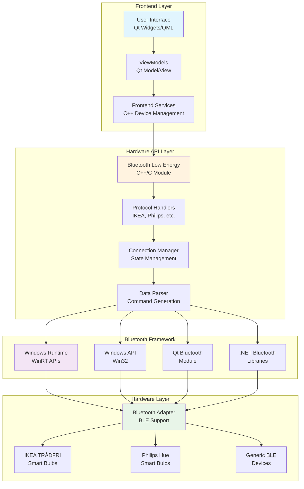
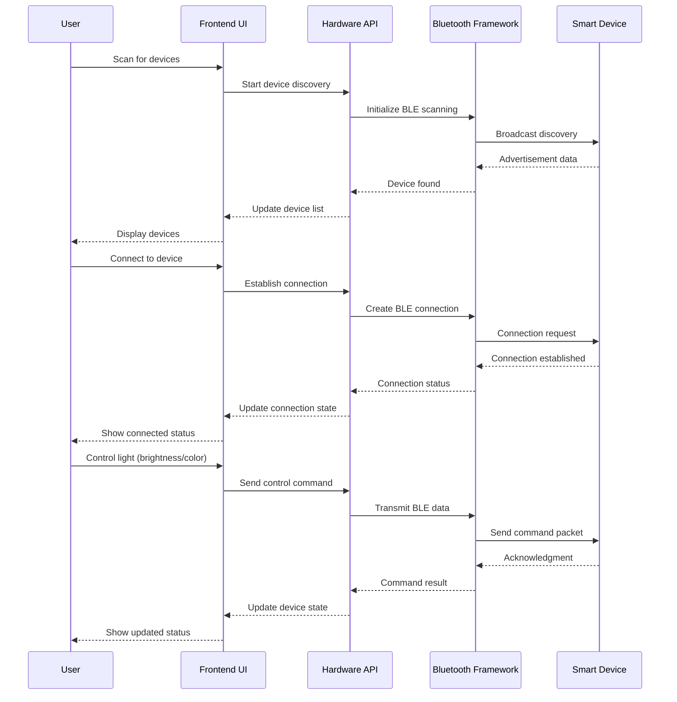
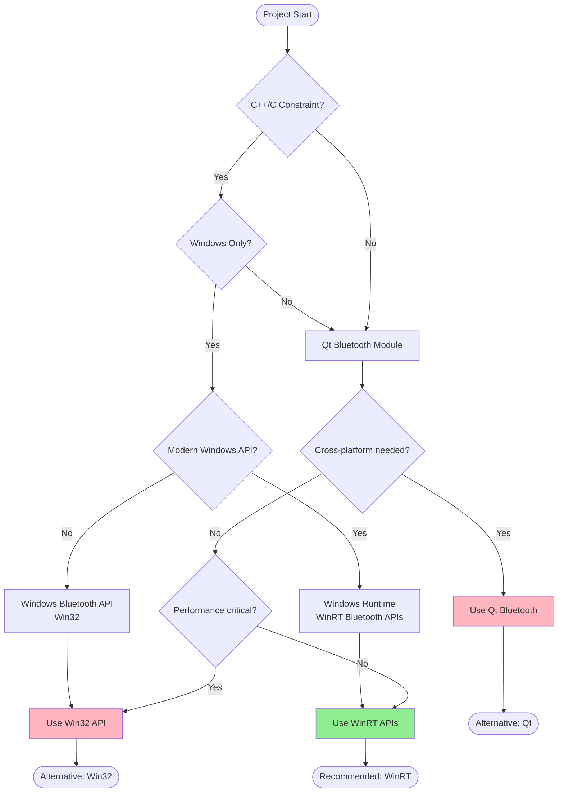
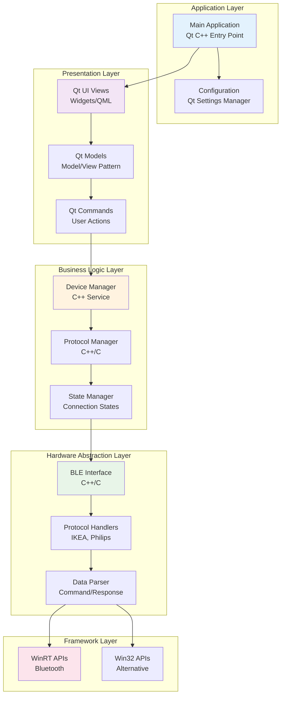
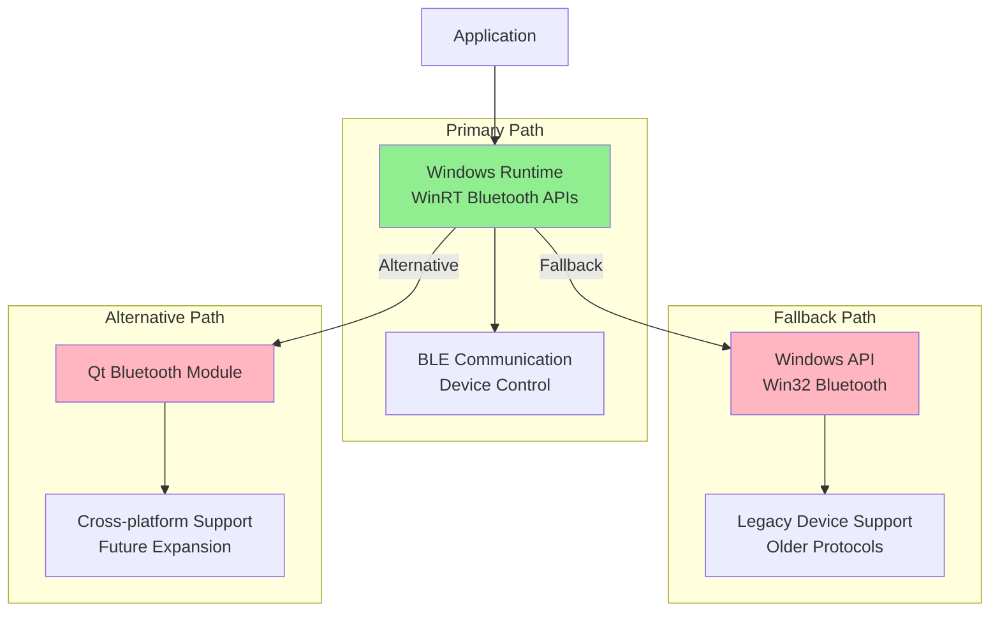
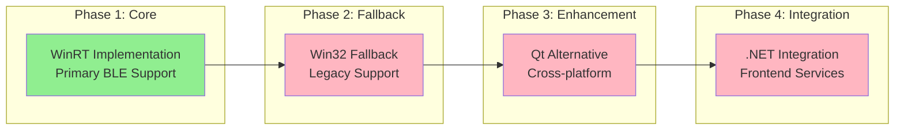

# BT-Lumina

Bluetooth Lumina is a Windows desktop application for controlling Bluetooth smart devices, particularly smart light bulbs from brands like IKEA and Philips. The project showcases embedded programming using a mix of C++ and C, providing a graphical user interface for device discovery, connection, and control.

## Project Overview

BT-Lumina serves as a sub-module of a larger BT-Control Panel system, specifically handling all bulb-related control functionality. The architecture is designed to be extensible, with future plans to include CCTV and controller APIs.

## Architecture Breakdown

### System Architecture Overview



### Data Flow Diagram



### Framework Selection Flow



### Component Interaction Architecture



### Frontend (Windows Desktop Application)

The frontend is a native Windows desktop application with multiple technology options:

#### **Option 1: C++/C Native Frontend** *(Recommended for C++/C Constraint)*

- **Framework**: Qt Widgets or Qt Quick (QML)
- **Language**: C++ with Qt framework
- **UI Components**:
  - Device discovery and scanning interface
  - Device connection management
  - Light bulb control panel (brightness, color, on/off)
  - Device status monitoring
  - Settings and configuration panel

**Pros**: Pure C++/C stack, no language interop needed, better performance
**Cons**: More complex UI development, larger Qt dependency

#### **Option 2: C# .NET Frontend** *(Alternative)*

- **Framework**: Windows Presentation Foundation (WPF) or Windows Forms (WinForms)
- **Language**: C# with .NET Framework
- **UI Components**: Same as above

**Pros**: Easier UI development, rich ecosystem, modern XAML
**Cons**: Requires C++/C interop, managed code overhead

#### **Option 3: Hybrid Approach** *(Flexible)*

- **Framework**: Qt for UI + C++/C for business logic
- **Language**: C++ with Qt + C for hardware API
- **Architecture**: Pure C++/C stack with Qt UI layer

**Pros**: Best of both worlds, consistent C++/C codebase
**Cons**: Qt learning curve, larger application size

## **Frontend Technology Comparison**

| Technology | Language | UI Framework | C++/C Integration | Performance | Development Speed |
|------------|----------|--------------|-------------------|-------------|-------------------|
| **Qt Widgets** | C++ | Qt | Native | Excellent | Moderate |
| **Qt Quick** | C++/QML | Qt | Native | Excellent | Fast |
| **WPF** | C# | XAML | Interop Required | Good | Fast |
| **WinForms** | C# | Windows Forms | Interop Required | Good | Very Fast |
| **Native Win32** | C++ | Win32 API | Native | Excellent | Slow |

#### **Recommended Approach for BT-Lumina:**

Given the C++/C constraint and embedded programming showcase requirement:

1. **Primary Choice**: Qt Widgets/Quick with C++
   - Pure C++/C stack throughout
   - Excellent performance and control
   - Rich UI capabilities
   - Cross-platform potential

2. **Alternative**: C# WPF with C++/C interop
   - Faster UI development
   - Modern XAML interface
   - Requires P/Invoke or COM interop

#### Frontend Responsibilities:
- Provide intuitive GUI for device interaction
- Handle user input and display device states
- Manage device discovery and connection UI
- Display real-time device status and feedback
- Handle application settings and preferences

### Hardware API Layer

The hardware API layer serves as the bridge between the frontend and Bluetooth devices:

- **Language**: C++ with C interop
- **Architecture**: Modular design with clear separation of concerns
- **Components**:
  - Bluetooth Low Energy (BLE) communication module
  - Device protocol handlers (IKEA, Philips, etc.)
  - Connection management and state handling
  - Data parsing and command generation

#### Hardware API Responsibilities:
- Bluetooth device discovery and scanning
- BLE connection establishment and management
- Device-specific protocol implementation
- Command encoding and data transmission
- Response parsing and error handling
- Connection state management and recovery

## Recommended Bluetooth Frameworks

### Framework Implementation Strategy

The Bluetooth framework implementation is **not** a "4 pick 1" situation. Instead, we recommend a **layered approach** that combines multiple frameworks for optimal functionality:

#### Primary Implementation: Windows Runtime (WinRT) + Fallback Strategy



#### Hybrid Implementation Benefits:

| Layer | Primary Framework | Fallback Framework | Use Case |
|-------|------------------|-------------------|----------|
| **Device Discovery** | WinRT APIs | Win32 APIs | Comprehensive device scanning |
| **BLE Communication** | WinRT BLE | Win32 BLE | Modern smart device support |
| **Legacy Support** | Win32 APIs | Qt Bluetooth | Older device compatibility |
| **Cross-platform** | Qt Bluetooth | Platform-specific | Future expansion |

### For Windows Desktop Development:

#### 1. **Windows Runtime (WinRT) Bluetooth APIs** *(Primary Choice)*

| Aspect | Details |
|--------|---------|
| **Pros** | Native Windows support, comprehensive BLE functionality, modern API design |
| **Cons** | Windows 10+ only, requires UWP or WinUI 3 for some features |
| **Best for** | Modern Windows applications with full BLE support |
| **Implementation** | Primary framework for most functionality |

#### 2. **Windows Bluetooth API (Win32)** *(Fallback & Legacy)*

| Aspect | Details |
|--------|---------|
| **Pros** | Direct Windows API access, maximum control, no additional dependencies |
| **Cons** | More complex API, requires more boilerplate code |
| **Best for** | Low-level control and performance-critical applications |
| **Implementation** | Fallback for unsupported devices, legacy protocol support |

#### 3. **Qt Bluetooth Module** *(Alternative & Cross-platform)*

| Aspect | Details |
|--------|---------|
| **Pros** | Cross-platform, mature framework, good C++ integration |
| **Cons** | Larger runtime, licensing considerations |
| **Best for** | Applications requiring cross-platform compatibility |
| **Implementation** | Alternative implementation, future cross-platform expansion |

#### 4. **.NET Bluetooth Libraries** *(Frontend Integration)*

| Aspect | Details |
|--------|---------|
| **Pros** | Easy integration with C# frontend, managed code benefits |
| **Cons** | Limited low-level control, potential performance overhead |
| **Best for** | Rapid development with managed code approach |
| **Implementation** | Frontend service layer, high-level device management |

### Recommended Implementation Approach for BT-Lumina:

**Core Architecture: WinRT + Win32 Hybrid**

1. **Primary Implementation**: Windows Runtime (WinRT) Bluetooth APIs
   - Use C++/WinRT for modern Bluetooth functionality
   - Provides excellent BLE support for smart devices
   - Native Windows integration

2. **Fallback Implementation**: Windows Bluetooth API (Win32)
   - For devices not supported by WinRT
   - Legacy protocol support
   - Maximum control when needed

3. **Alternative Implementation**: Qt Bluetooth Module
   - For cross-platform future expansion
   - When WinRT/Win32 limitations are encountered

4. **Frontend Integration**: .NET Bluetooth Libraries
   - High-level device management in C# frontend
   - Simplified API for common operations

#### Implementation Priority:



## Project Structure

```
bt-lumina/
├── src/
│   ├── frontend/           # C# WPF/WinForms application
│   │   ├── UI/            # User interface components
│   │   ├── ViewModels/    # MVVM pattern implementation
│   │   └── Services/      # Frontend services
│   ├── hardware-api/      # C++/C hardware interface
│   │   ├── bluetooth/     # Bluetooth communication
│   │   ├── protocols/     # Device-specific protocols
│   │   └── utils/         # Utility functions
│   └── shared/            # Shared components
├── include/               # Header files
├── libs/                  # External libraries
├── docs/                  # Documentation
└── tests/                 # Unit and integration tests
```

## Supported Devices

### Smart Light Bulbs
- **IKEA TRÅDFRI**: Zigbee over Bluetooth
- **Philips Hue**: Bluetooth Low Energy
- **Generic BLE Bulbs**: Standard BLE protocols

### Future Device Support
- CCTV cameras with Bluetooth connectivity
- Bluetooth controllers and input devices
- Other IoT devices with BLE capabilities

## Development Setup

### Prerequisites
- Windows 10/11 with Bluetooth support
- Visual Studio 2019/2022 with C++ and C# workloads
- Windows 10 SDK (for Bluetooth APIs)
- .NET Framework 4.8 or .NET 6+

### Build Requirements
- CMake 3.15+
- Git
- Bluetooth adapter with BLE support

## License

This project is licensed under the MIT License - see the [LICENSE](LICENSE) file for details.

## Contributing

1. Fork the repository
2. Create a feature branch
3. Make your changes
4. Add tests for new functionality
5. Submit a pull request

## Roadmap

- [ ] Basic Bluetooth device discovery
- [ ] IKEA TRÅDFRI bulb support
- [ ] Philips Hue bulb support
- [ ] Device connection management
- [ ] Light control interface
- [ ] Device status monitoring
- [ ] Settings and configuration
- [ ] Error handling and recovery
- [ ] Performance optimization
- [ ] Documentation and examples

