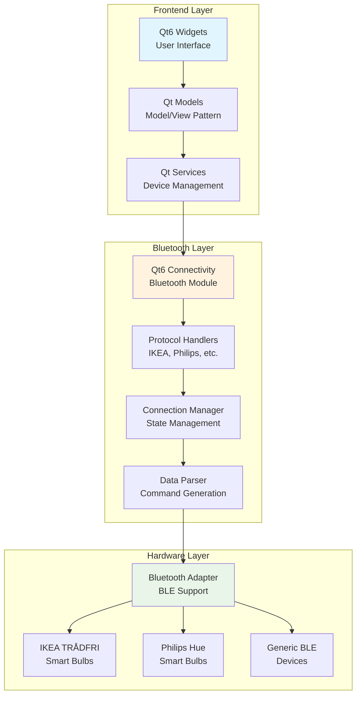
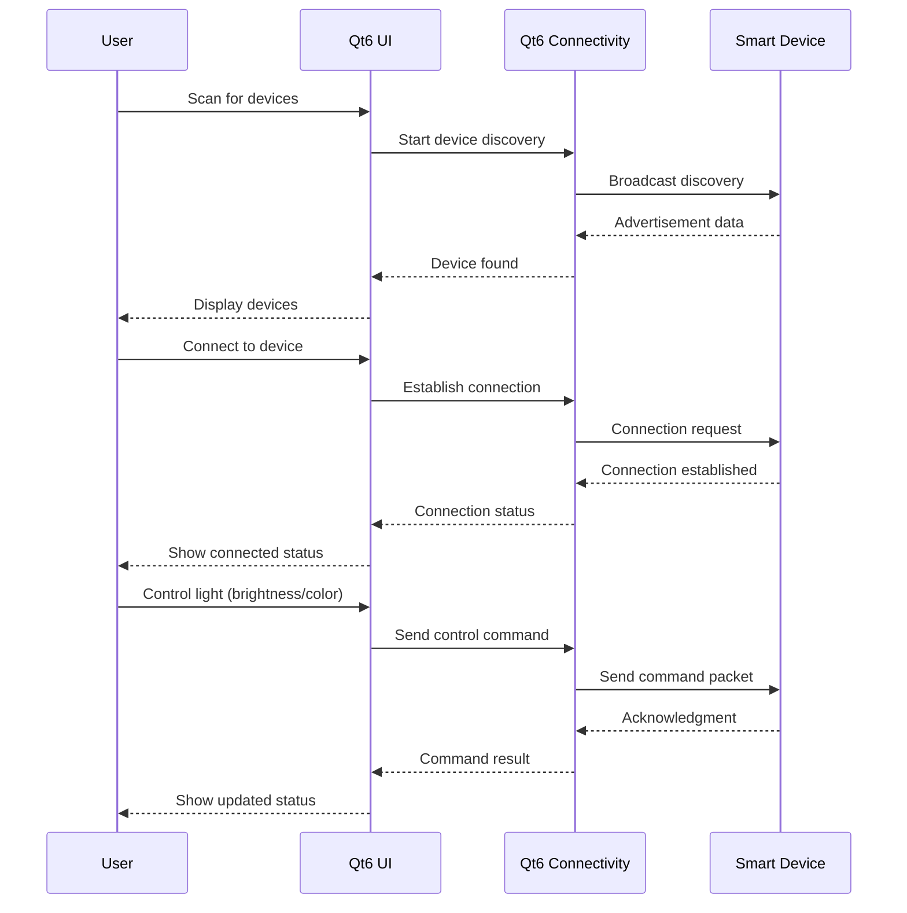
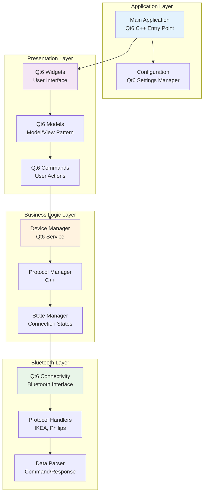

# BT-Lumina

Bluetooth Lumina is a Windows desktop application for controlling Bluetooth smart devices, particularly smart light bulbs from brands like IKEA and Philips. The project showcases embedded programming using Qt6 framework with C++, providing a graphical user interface for device discovery, connection, and control.

## Project Overview

BT-Lumina serves as a sub-module of a larger BT-Control Panel system, specifically handling all bulb-related control functionality. The architecture is designed to be extensible, with future plans to include CCTV and controller APIs.

## Technology Stack

### **Selected Technology Stack**
- **Frontend Framework**: Qt6 Widgets (C++)
- **Bluetooth Communication**: Qt6 Connectivity Module
- **Build System**: CMake with vcpkg
- **Language**: C++17
- **Platform**: Windows 10/11

### **Why Qt6?**
- **Unified Technology Stack**: Both GUI and Bluetooth communication use Qt6
- **Cross-platform Potential**: Future expansion to Linux/macOS
- **Modern C++**: Excellent C++17 support with Qt6
- **Embedded Programming**: Suitable for embedded system development
- **Rich Ecosystem**: Comprehensive documentation and community support

## Architecture Breakdown

### System Architecture Overview



### Data Flow Diagram



### Component Interaction Architecture



## Project Structure

```
bt-lumina/
├── src/                    # Source files
│   └── main.cpp           # Main application entry point
├── resources/              # Qt resources
│   └── resources.qrc      # Resource file
├── CMakeLists.txt         # CMake build configuration
├── vcpkg.json            # vcpkg dependencies
├── DependencyInstaller.bat    # Dependency installation script
├── VisualStudioSolutionGenerator.bat  # VS solution generator
├── README.md              # This file
└── LICENSE                # MIT License
```

## Dependencies

### **Core Dependencies**
- **qtbase**: Qt6 core functionality and widgets
- **qtconnectivity**: Qt6 Bluetooth connectivity module

### **Build Dependencies**
- **CMake**: 3.16 or higher
- **vcpkg**: Microsoft's C++ package manager
- **Visual Studio 2022**: With C++ workload

## Supported Devices

### Smart Light Bulbs
- **IKEA TRÅDFRI**: Zigbee over Bluetooth
- **Philips Hue**: Bluetooth Low Energy
- **Generic BLE Bulbs**: Standard BLE protocols

### Future Device Support
- CCTV cameras with Bluetooth connectivity
- Bluetooth controllers and input devices
- Other IoT devices with BLE capabilities

## Development Setup

### Prerequisites
- Windows 10/11 with Bluetooth support
- Visual Studio 2022 with C++ workload
- Git
- CMake 3.16+

### Quick Start
1. **Install Dependencies**:
   ```bash
   .\DependencyInstaller.bat
   ```

2. **Generate Visual Studio Solution**:
   ```bash
   .\VisualStudioSolutionGenerator.bat
   ```

3. **Build and Run**:
   - Open `generated-vs/bt-lumina.sln`
   - Build and run the project

## Features

### **Current Features**
- [x] Qt6-based GUI framework
- [x] Bluetooth device discovery
- [x] Device connection management
- [x] Modern C++17 implementation
- [x] CMake build system
- [x] vcpkg dependency management

### **Planned Features**
- [ ] IKEA TRÅDFRI bulb support
- [ ] Philips Hue bulb support
- [ ] Light control interface (brightness, color)
- [ ] Device status monitoring
- [ ] Settings and configuration
- [ ] Error handling and recovery
- [ ] Performance optimization

## License

This project is licensed under the MIT License - see the [LICENSE](LICENSE) file for details.

## Contributing

1. Fork the repository
2. Create a feature branch
3. Make your changes
4. Add tests for new functionality
5. Submit a pull request

## Roadmap

- [ ] Basic Bluetooth device discovery
- [ ] IKEA TRÅDFRI bulb support
- [ ] Philips Hue bulb support
- [ ] Device connection management
- [ ] Light control interface
- [ ] Device status monitoring
- [ ] Settings and configuration
- [ ] Error handling and recovery
- [ ] Performance optimization
- [ ] Documentation and examples

