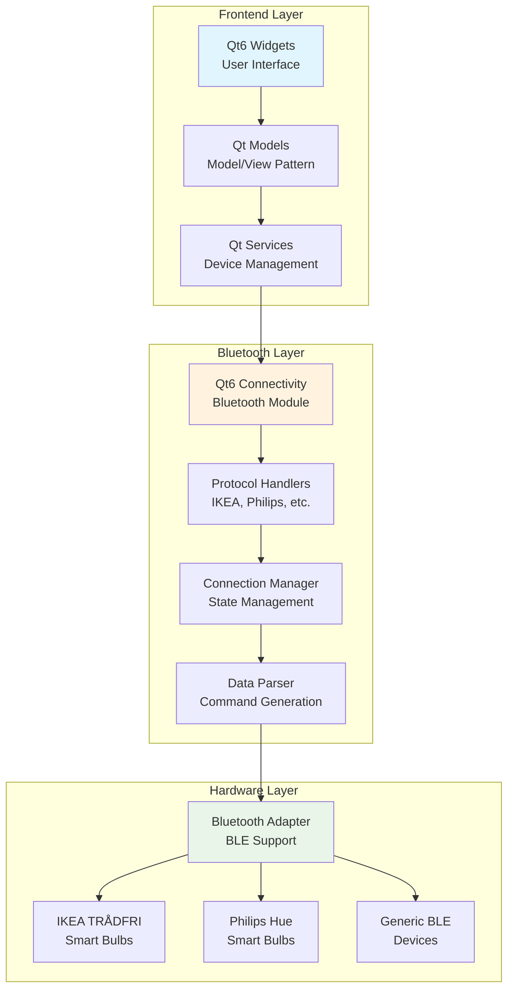
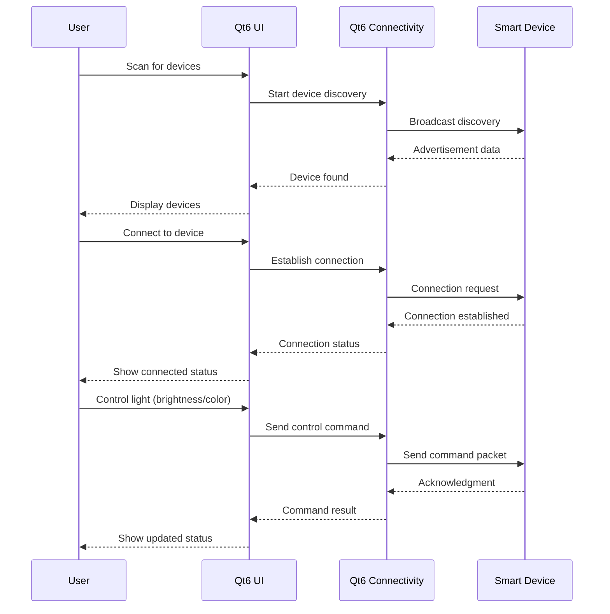
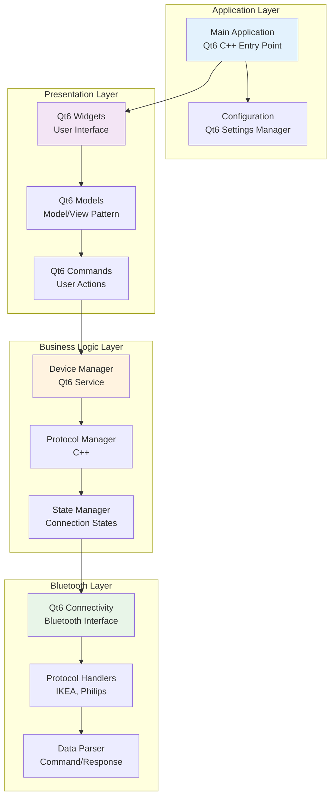

# BT-Lumina

Bluetooth Lumina is a Windows desktop application for controlling Bluetooth smart devices, particularly smart light bulbs from brands like IKEA and Philips. The project showcases embedded programming using Qt6 framework with C++, providing a graphical user interface for device discovery, connection, and control.

## Project Overview

BT-Lumina serves as a sub-module of a larger BT-Control Panel system, specifically handling all bulb-related control functionality. The architecture is designed to be extensible, with future plans to include CCTV and controller APIs.

## Technology Stack

### **Selected Technology Stack**
- **Frontend Framework**: Qt6 Widgets (C++)
- **Bluetooth Communication**: Qt6 Connectivity Module
- **Build System**: CMake with vcpkg
- **Language**: C++17
- **Platform**: Windows 10/11

### **Why Qt6?**
- **Unified Technology Stack**: Both GUI and Bluetooth communication use Qt6
- **Cross-platform Potential**: Future expansion to Linux/macOS
- **Modern C++**: Excellent C++17 support with Qt6
- **Embedded Programming**: Suitable for embedded system development
- **Rich Ecosystem**: Comprehensive documentation and community support

## Architecture Breakdown

### System Architecture Overview



### Data Flow Diagram



### Component Interaction Architecture



## Project Structure

```
bt-lumina/
├── src/                    # Source files
│   └── main.cpp           # Main application entry point
├── resources/              # Qt resources
│   └── resources.qrc      # Resource file
├── CMakeLists.txt         # CMake build configuration
├── vcpkg.json            # vcpkg dependencies
├── DependencyInstaller.bat    # Dependency installation script
├── VisualStudioSolutionGenerator.bat  # VS solution generator
├── README.md              # This file
└── LICENSE                # MIT License
```

## First Setup

### Prerequisites
- Windows 10/11 with Bluetooth support
- Visual Studio 2022 with C++ workload
- Git
- CMake 3.16+

### Step 1: Install Required Dependencies

#### 1.1 Install vcpkg and Basic Dependencies (Automatic)
Run the following script to install most dependencies (if vcpkg is not installed, it will be downloaded automatically):

```cmd
DependencyInstaller.bat
```

#### 1.2 Manually Install Qt6 Dependencies (Classic Mode)
Due to known issues with vcpkg manifest mode and Qt6, you **must** manually install Qt6 dependencies using classic mode:

```cmd
C:\vcpkg\vcpkg.exe install qtbase qtbase:x64-windows --classic
C:\vcpkg\vcpkg.exe install qtconnectivity qtconnectivity:x64-windows --classic
```

> ⚠️ **Note:** If your vcpkg is not installed at `C:\vcpkg`, adjust the path accordingly.

### Step 2: Generate the Visual Studio Solution
Run the following script to generate the Visual Studio solution (this will create the `generated-vs` directory):

```cmd
VisualStudioSolutionGenerator.bat
```

### Step 3: Build and Run
Open the generated solution at:
- `generated-vs/bt-lumina.sln`

Press **F5** to build and run the application.

> **⚠️ Important First-Time Setup**
> The first time you open the solution, you may need to manually set the startup project:
> 1. In **Solution Explorer**, right-click on `bt-lumina`.
> 2. Select **"Set as StartUp Project"** from the menu.
> You only need to do this once.

### Troubleshooting
- **CMake cannot find Qt6Config.cmake?**
  - Make sure you have manually installed Qt6 dependencies in classic mode as described above.
  - When generating the solution, ensure you use these CMake parameters if building manually:
    ```
    -DCMAKE_TOOLCHAIN_FILE=C:/vcpkg/scripts/buildsystems/vcpkg.cmake
    -DCMAKE_PREFIX_PATH=C:/vcpkg/installed/x64-windows
    ```

For more help, see the [vcpkg documentation](https://learn.microsoft.com/vcpkg/) or open an issue in this repository.

## Features

### **Current Features**
- [x] Qt6-based GUI framework
- [x] Bluetooth device discovery
- [x] Device connection management
- [x] Modern C++17 implementation
- [x] CMake build system
- [x] vcpkg dependency management

### **Planned Features**
- [ ] IKEA TRÅDFRI bulb support
- [ ] Philips Hue bulb support
- [ ] Light control interface (brightness, color)
- [ ] Device status monitoring
- [ ] Settings and configuration
- [ ] Error handling and recovery
- [ ] Performance optimization

## License

This project is licensed under the MIT License - see the [LICENSE](LICENSE) file for details.

## Contributing

1. Fork the repository
2. Create a feature branch
3. Make your changes
4. Add tests for new functionality
5. Submit a pull request

## Roadmap

- [ ] Basic Bluetooth device discovery
- [ ] IKEA TRÅDFRI bulb support
- [ ] Philips Hue bulb support
- [ ] Device connection management
- [ ] Light control interface
- [ ] Device status monitoring
- [ ] Settings and configuration
- [ ] Error handling and recovery
- [ ] Performance optimization
- [ ] Documentation and examples

