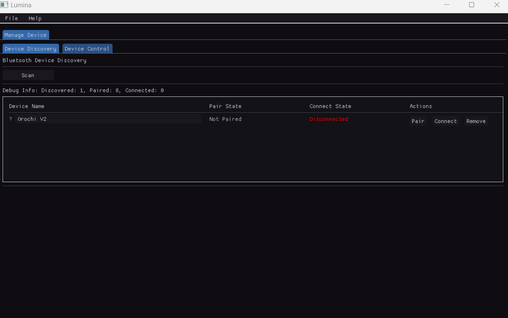

# BT-Lumina

Lumina is an ImGui-based BLE controller. This project provides a lightweight, Windows GUI application for managing Bluetooth devices using ImGui + GLFW3 + OpenGL.



> **Note**: This project is currently halt due to direction reaglinment.

## Project Structure

```
bt-lumina/
├── CMakeLists.txt         # CMake build configuration
├── vcpkg.json             # Dependency manifest
├── generate.bat           # Install dependencies and generate solution
├── README.md              # This file
├── src/                   # Source code
│   └── main.cpp           # Main application entry point
└── resources/             # Resource files (if any)
```

## Prerequisites

To build and run this project, external dependencies are required. The `generate.bat` script will install them accordingly.

| Dependency | Version/Details |
|------------|----------------|
| **ImGui**  | Latest version |
| **GLFW3**  | Version 3.4 or higher |

## Running the Project

### Step 1: Generate Solution

Execute the generator script. This will install dependencies and generate the Visual Studio solution:

```cmd
/generate.bat
```

The solution will be generated in 
```cmd
/generated-vs/
```

### Step 2: Build and Run

Open the generated solution located at:
```cmd
/generated-vs/bt-lumina.sln
```


## Learning Resources

- [ImGui Documentation](https://github.com/ocornut/imgui)
- [GLFW Documentation](https://www.glfw.org/documentation.html)

